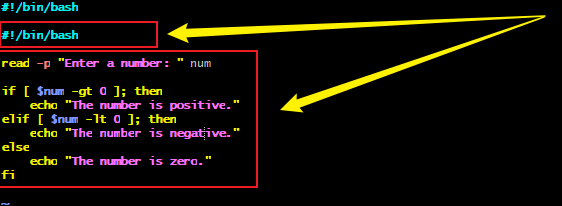
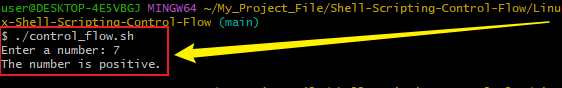
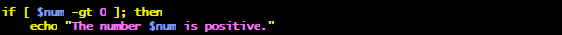
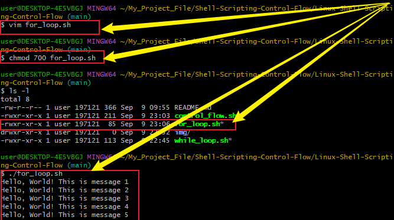
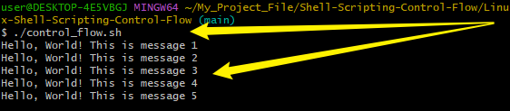
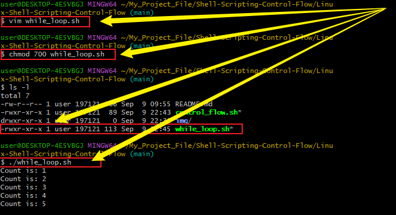
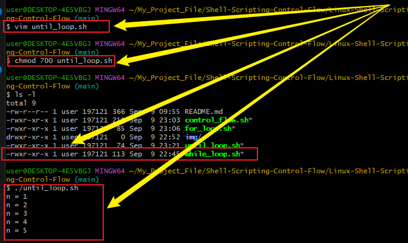
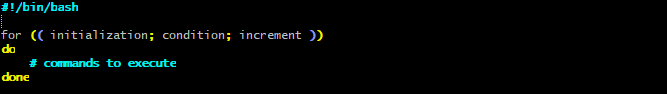
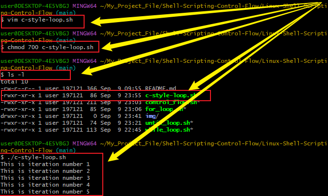

# Linux-Shell-Scripting-Control-Flow
In this project, I explored the power of shell scripting with a focus on mastering control flow constructs. It covered key elements such as conditional statements and loops, showing how they can be applied to automate tasks in a Linux environment. This demonstrates how scripting improves efficiency and reduces manual effort.

## Control Flow in Shell Scripting

Control flow statements are the backbone of decision-making in programming. In shell scripting, these statements allow scripts to determine what actions to perform and how to perform them, based on conditions, loops, or user input. They provide flexibility and logic, enabling scripts to move beyond simple sequential execution.

Common control flow statements supported by the shell interpreters include:

- if–else statements for conditional branching

- for loops to iterate over a list of items

- while loops to repeat tasks while a condition remains true

- case statements to handle multiple possible conditions in a structured way

Together, these constructs give shell scripts the ability to adapt to different scenarios, automate decision-making, and execute tasks efficiently.

## The task

here i creared a simple script using vim that ask a number and then tell us if the number is positive, negative or zero. i started by writing the shebang #!/bin/bash which is a must for all script and then followed by the code. 



## Running the control_flow.sh
after i saved the script, i executed the script using ./control_flow command, provided the the input as 7 and output relased. 

 

 ## Analyzing the script
### Shebang
- #!/bin/bash called the shebang is a special line at the start of a script that tells Linux: Run this script with the Bash shell.
- The command read -p "Enter a number: " num displays the prompt "Enter a number:" and stores the user’s input in the variable num.


### If-statement 

- The code checks if the number stored in num is greater than 0, and if true, echo returns that the number is positive.



### elif statement

- The code checks if the value of num is less than 0, and if true, it echoes that the number is negative.

  

### else-statement

- This part runs if none of the earlier conditions are true, meaning the number entered must be 0. In that case, the script uses echo to print: “The number 0 is zero.”


- fi: This keyword marks the end of the if statement. It tells the shell that the if...else block is finished. 

## Loops

A loop is used to repeat task automatically. Loops are inevitable when you need to repeat tasks without writing the same code multiple times. Here are some common scenarios:

- Processing multiple files: Example are- Renaming, moving, or backing up all files in a folder.

- Iterating over users: Example are- Checking if multiple user accounts exist.

- Automating system checks: Example are- Continuously monitoring CPU usage until it drops below a certain level.

- Working with lists or ranges: Example are- Printing numbers 1 to 100 or looping through a list of IP addresses.

- Retrying a task: Example are- Trying to connect to a server every few seconds until it succeeds.

- Menu-driven programs: Example are- Showing a menu repeatedly until the user chooses to exit.

- Log file monitoring: Example are- Continuously reading new lines from a log file (while loop).

## Example of Loop
### for loop
For loop is to repeat a fixed set or list.

Example of a real world scenerio



- #!/bin/bash: This is the shebang line. It tells the system to use the Bash shell to run the script.

- for i in 1 2 3 4 5: The variable i takes each value in the list (1, 2, 3, 4, 5) one by one. On the first iteration, i=1; second, i=2; and so on until i=5.

- do: Marks the beginning of the loop body. All commands between do and done will run once for each value of i.

- echo "Hello, World! This is message $i": The echo command prints text to the terminal. "Hello, World! This is message $i" is the string to print. $i expands to the current value of i in the loop.

- done: Marks the end of the loop.

After done, the loop continues to the next value of i until all are used.

### Running for loop
```
After saving the script in the Vim editor, I executed the file in the terminal and observed the resulting output. This allowed me to verify that the script ran correctly and produced the expected results.
```


## Task 1
- Create a shell script for each types of loop.
- Inserting the code in the file
- set the correct permission for the file.
- Execute the script and evaluate the xperience.

## For Loop
```
In this example, I created a script named for_loop.sh using vim text editor and inserted the necessary code before saving the file. I then granted full execution permissions to the file’s owner using the chmod command, ensuring that the owner could run the script. Finally, I executed the script to observe its behavior and verify that it functioned as intended.
```


## While loop
```
In this example, I created a script named while_loop.sh using vim text editor and inserted the necessary code before saving the file. I then granted full execution permissions to the file’s owner using the chmod command, ensuring that the owner could run the script. Finally, I executed the script to observe its behavior and verify that it functioned as intended.
```
#

## Until loop
```
In this example, I created a script named until_loop.sh using vim text editor and inserted the necessary code before saving the file. I then granted full execution permissions to the file’s owner using the chmod command, ensuring that the owner could run the script. Finally, I executed the script to observe its behavior and verify that it functioned as intended.
```


# C-Style Loop
```
A C-style loop is a type of loop in Bash scripting that is written in a style similar to the C programming language concept. It is mainly used when you know in advance how many times you want to repeat a task.
```


- initialization: This sets the starting point of the loop Example: i=1 (starts counting from 1)
- condition: This is a test that determines if the loop should continue. Example: i<=5 (keep looping as long as i is less than or equal to 5).
- increment: This i updates the loop variable after each iteration. Example: i++ (adds 1 to i after each loop).
- do to done: This marks the body of the loop, which contains the commands that will be executed each time the loop runs.

## Example of C-Style loop
```
In this example, I created a script named until_loop.sh using vim text editor and inserted the necessary code before saving the file. I then granted full execution permissions to the file’s owner using the chmod command, ensuring that the owner could run the script. Finally, I executed the script to observe its behavior and verify that it functioned as intended.
```

